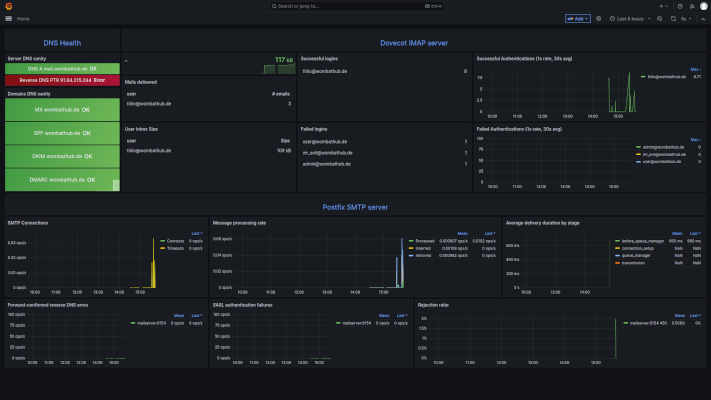

# mailserver

Dockerised mailserver, inspired by https://jan.wildeboer.net/2022/08/Email-1-Postfix-2022/ .

**Prerequisites**
- A server on the internet
- A DNS domain for sending / receiving mails. Multiple domains are supported.

**Features**
- Fully automated set-up based on very few settings, including
  - certificates generation and renewal
  - SPF, DKIM, and DMARC integration
- Basic user handling (add/delete, aliases)
- Monitoring suite with dashboards for mailserver, IMAP server, and DNS sanity



# TL;DR

**Set up server**

1. `cp settings.env.empty settings.env`; edit `settings.env` and fill in:
   ```
   DOMAIN=
   HOSTNAME=
   ADMIN_EMAIL=
   ADDITIONAL_DOMAINS=
   ```
   If you leave `METRICS=true` also set `GF_SECURITY_ADMIN_PASSWORD=` or you won't be able to log into the metrics website.

**Create A DNS entry for your mail server**

Go to your DNS service provider and create a DNS entry for `HOSTNAME` pointing to your server's IP.

**Start server**

The server needs ports 80 for http, 25 and 465 for SMTP(s), and 143 and 993 for IMAP.
Monitoring needs port 443 for HTTPS.
See "Issues and Workarounds" for when ports 80 and 443 are already in use on your host.

1. `./start_mailserver.sh` <br/>
   If you left `METRICS=true`, also run `start_monitoring.sh`. <br/>
   Monitoring dashboards can be accessed at `https://<HOSTNAME>/monitoring/`.
   

On first run the server will initialise, request letsencrypt certificates, generate DKIM keys, and generate DH parameters for the mail server's TLS connections.
This can take a few minutes.

**Set up DNS for your domain**

1. Add an MX record to `DOMAIN` and (if applicable) `ADDITIONAL_DOMAINS` and point it to `HOSTNAME`.
2. Basic validation of DNS settings:
   ```shell
   ./dns_check.sh
   ```
   SPF, DMARC, and DKIM checks will fail in this run because these were not set up yet. <br/>
   The script will print out example SPF, DMARC, and DKIM DNS entries to use in the next step.
3. Add SPF, DMARC, and DKIM DNS entries for all domains based on the `dns_check.sh` script output. <br />
   Alternatively, consult the DNS dashboard (if you use monitoring) at `https://HOSTNAME/monitoring/d/dnsy/dns-sanity` - it also has SPF, DMARC, and DKIM records for copy+pasting to your DNS provider.
4. Run the validation script again:
   ```shell
   ./dns_check.sh
   ```
   All checks should now pass. <br/>
   Use https://www.checktls.com/TestReceiver or https://mxtoolbox.com/dnscheck.aspx for more thorough checks.

**Manage users and aliases**

User management works transparently for both `DOMAIN` and `ADDITIONAL_DOMAINS`.

1. `./user.sh add meier@entropiesenke.de 12345` add user w/ password `12345`
2. `./user.sh add jens@wombathub.de` add user and auto-generate (and print) password
3. `./user.sh list` list users
4. `./user.sh del jens@wombathub.de` del user `jens@wombathub.de`. Use `.. --purge-inbox ..` to also delete all emails.
5. To manage aliases, edit `_server_workspace_/etc/postfix/valias` (`<alias email>  <domain user>` key value, separated by space), then run `./user.sh update-aliases`.

**Client set-up for mail server users**

1. *Username*: is the `user@domain` name supplied to `user.sh add ...`. Password is the password provided (or generated).
2. SMTP/IMAP server is `HOSTNAME`. <br/>
   SMTP is available via STARTTLS at port 25, and via SSL/TLS at port 465. <br/>
   IMAP is on port 143, IMAPS on 993.


**Automatically start at boot**

1. Stop the mailserver and (if applicable) the monitoring service.
2. `cp systemd/ /etc/systemd/system/`
3. `systemd daemon-reload`
4. `systemd enable --now mailserver` <br/>
    For monitoring: `systemd enable --now mailserver-monitoring`

If you use custom ports for HTTP and HTTPS don't forget to update mailserver.service and add the ports as positional arguments to `ExecStart=/opt/mailserver/start_mailserver.sh`.

# How to use

To get started, you'll need an internet-connected server as well as a DNS name pointing to it.
DNS is a requirement for getting letsencrypt certificates.

## Set up your mail server

Copy the skeleton `settings.env.empty` to `settings.env`, then edit the file and fill in variables that have no default value set.
Note that your mail server `HOSTNAME` does not necessarily need to be a member of `DOMAIN` - `mail.t-lo.net` can happily serve mails for users of domain `wombathub.de`.
```shell
# Name of your main email domain. Likely (but not necessarily) the domain part of your hostname.
DOMAIN=

# Hostname of the mail server. A valid DNS name entry must exist and point to this server's IP address.
HOSTNAME=

# Administrative email address for Letsencrypt certificate requests.
ADMIN_EMAIL=

# Comma-separated list of additiona domain names for which this server will accept mail.
# Also known as "virtual domains".
ADDITIONAL_DOMAINS=
```

**NOTE** this is a docker environment file. Do not use quotation marks around values as these will become part of the value. <br/>
Use e.g. `HOSTNAME=mymail.mydomain.tld`, not `HOSTNAME="mymail.mydomain.tld"`.

By default, metrics / monitoring is enabled.
If you want to disable it, set
```
METRICS=false
```

For access to monitoring dashboards, a password must be set.
Set the password with:
```
GF_SECURITY_ADMIN_PASSWORD=
```

## Set up DNS for your mailserver

A correct and complete DNS setup is important not only for your mailserver to be found but also for other mailservers to trust your server.

**A record and reverse-DNS PTR**

First, make you're you have an A record (a generic server entry) for your server's `HOSTNAME` pointing to your server's public IP address.
This is commonly i(generalised) referred to as "DNS entry".
If you run a `ping -n $HOSTNAME` your mail server's IP should be pinged.

**NOTE** The A record should be created before the mail server is started for the first time.
Letsencrypt requires a correct A record to be set in order to grant certificates.

Complementarily, create a PTR for your server's public IP address to `HOSTNAME`.
When sending email, other mail servers will look up your server's A record, reverse-DNS resolve the IP address via the PTR record, and compare the results.

## Start the mail server container

This will allow the system to bootstrap / initialise.

Start the server:
```shell
$ ./start_mailserver.sh
```

The above script will forward the following TCP ports to the mail server container:
- 80: HTTP, for letsencrypt's www challenges. We'll assume you do not have a webserver running on your mailserver (see "Issues and Workarounds" below if you do).
  - 443: HTTPS if `METRICS=true` for the monitoring dashboards.
- 25, 465: SMTP and SMTPS
- 143, 993: IMAP and IMAPS


Initial start-up can take a few minutes since it requests letsencrypt certificates, generates DKIM keys, and calculates DH parameters for postfix' TLS connections to other SMTP servers.
Subsequent start-ups will be much faster.
Furthermore, the script binds the local `_server_workspace_` directory into the container for all stateful data, and it passes the `settings.env` environment into the container.
For instance, letsencrypt certificates for the mail service are stored in `_server_workspace_/etc/letsencrypt`.

If you configured monitoring (`METRICS=true`), also start the monitoring container:
```shell
$ ./start_monitoring.sh
```

Monitoring dashboards can now be accessed at `https://<HOSTNAME>/monitoring/`.


## Set up Mailserver DNS entries for your domain(s)

First, run a DNS check to get a report on what's missing, and how to fix it:
```shell
$ ./dns_check.sh
```
Almost all checks (except for host DNS and PTR) will fail at this point.
However,the script will print out example SPF, DMARC, and DKIM DNS entries which we'll use to set up domain DNS for our mailserver.

**NOTE** If you are using monitoring, example SPF, DMARC, and DKIM records can also be found in the "DNS Sanity" dashboard:
`https://HOSTNAME/monitoring/d/dnsy/dns-sanity`.
The dashboard also provides live checks for all host and domain DNS settings and instant feedback on changes.

Simply copy+paste the entries from the dashboard into the DNS configuration of your DNS provider.

**MX, SPF, DMARC, and DKIM records for all domains served by the mailserver**

Every domain served by the mailserver (both the main `DOMAIN` as well as additional domains listed in `ADDITIONAL_DOMAINS`) needs MX, SPF, DMARC, and DKIM entries added.
This makes it easier for other mail servers to trust us when we send mails to them.
Not setting these up risks being classified as spammer and having mails we send quarantined, or rejected outright.

First, add an MX entry for `HOSTNAME` to all domains served by the mailserver.
MX defines which mail server(s) is/are handling email for a domain.
Add MX record to all domains (`DOMAIN` and `ADDITIONAL_DOMAINS` if you use these).

Then, add an [SPF](https://en.wikipedia.org/wiki/Sender_Policy_Framework) record to all domains served by the mailserver.
SPF defines which IP addresses are allowed to send mail for a domain.
Contrary to MX, SPF does not use a specific DNS entry type - instead, SPF information is recorded in a TXT entry.
A very simple TXT SPF record is e.g. `v=spf1 a mx ip4:<ipv4> -all` (replace `<ipv4>` with the mail server's public IP).
Add this TXT record to all domains (`DOMAIN` and `ADDITIONAL_DOMAINS` if you use these).

Thirdly, add a [DMARC](https://en.wikipedia.org/wiki/DMARC) entry to all domains.
DMARC records prevent domain spoofing and are published in a TXT record to a `_dmarc.` subdomain.
For example, domain `wombathub.de` would define its DMARC record at `_dmarc.wombathub.de`.
A very simple TXT DMARC record is e.g. `v=DMARC1;p=quarantine;sp=quarantine;pct=100;adkim=r;aspf=r;rua=mailto:abuse@<DOMAIN>;ruf=mailto:abuse@<DOMAIN>;ri=1800;fo=1` (replace `<DOMAIN>` with the domain you're setting the record up for).
Add this TXT record to a `_dmarc` subdomain for all domains (`DOMAIN` and `ADDITIONAL_DOMAINS` if you use these).

Lastly, add a [DKIM](https://en.wikipedia.org/wiki/DomainKeys_Identified_Mail) record to each domain.
DKIM deals with domain keysi, the public part of which is stored in DNS.
It allows mailservers to verify whether incoming email really originated from the mailserver an email claims to be coming from.
DKIM uses TXT entries to a subdomain determined by the DKIM "selector": `<selector>._domainkey.`
THe selector can be configured in `settings.env` and defaults to `mailserver`.
DKIM keys are generated during initial set-up; refer to the output of `dns_check.sh` 
Add DKIM TXT records containing the public DKIM keys as printed out by `dns_check.sh` to `mailserver._domainkey` subdomain for all domains (`DOMAIN` and `ADDITIONAL_DOMAINS` if you use these).

The keys are stored at `_server_workspace_/etc/opendkim/keys/`; you can also consult the `.txt` files in that directory to get the DKIM TXT record instead of looking at the script output.

**Test your DNS set-up**

Now it's time to run the DNS test again:
```shell
./dns_check.sh
```
More complex checks are available via e.g.https://www.checktls.com/TestReceiver and https://mxtoolbox.com/dnscheck.aspx.

## User management: Add or delete users, create aliases

The container ships a few comfort scripts for adding and removing users.
These scripts reside in the repo's main directory and call implementations inside the container.
The counterparts inside the container reside in th repo's `scripts/` directory and are added to the container at build time (see `Dockerfile`).

### Add a new user

```shell
$ ./user.sh add jens@wombathub.de
Created user 'jens@wombathub.de', generated password is:'0sw;eZxqh(M6mmjlnqu;'.
```
**NOTE** Password is *within* the single quotes (`'`). The single quotes are *not* part of the password.

Create users for any of the DOMAIN or ADDITIONAL_DOMAINS you've defined in the server settings.
For the user's IMAP and SMTP access you can either supply a password or have the script auto-generate one.
In the latter case the password is printed after the user has been generated.

To add user "meier" with password "12345" to domain "entropiesenke.de", run
```shell
$ ./user.sh add meier@entropiesenke.de 12345
Created user 'meier@entropiesenke.de' with password provided.
```

## List all users

```shell
$ ./user.sh list
```

Displays a list of all users and their inbox sizes.

### Delete a user

```shell
$ ./user.sh del jens@wombathub.de
Deleted 'jens@wombathub.de'.
```

This removes a user and prevents them from accessing the server.
Optionally, the email inbox (all of the user's emails) can also be deleted.
If the inbox is not deleted, the user can later be re-created (see `add_user.sh`) to re-enable access.

```shell
$ ./user.sh del --purge-inbox jens@wombathub.de
Deleted 'jens@wombathub.de' and purged mail/inboxes/wombathub.de/jens@wombathub.de.
```

### Manage aliases

User aliases are maintained in `_server_workspace_/etc/postfix/valias` and can be edited directly.

The aliases file's structure is very simple. Each line defines one alias:
```
[alias-source-email] [alias-target-user]
```

While alias sources are complete email addresses - `user@domain` and all domains can be used, alias destinations are limited to user accounts on the mail server's main `DOMAIN`.
Assuming `DOMAIN=wombathub.de` and `ADDITIONAL_DOMAINS=entropiesenke.de`, this example
```
postmaster@entropiesenke.de karl
abuse@entropiesenke.de karl
```
sets up account `karl@wombathub.de` to also receive email for `abuse@entropiesenke.de` and `postmaster@entropiesenke.de`.
The account `karl@wombathub.de` must of course exist for this to work.

**Update the aliases after changing `_server_workspace_/etc/postfix/valias` by running**
```
$ ./user.sh update-aliases
```

## Mail client settings

**Server settings**

The server supports plain SMTP (enforces STARTTLS), SMTP over SSL, IMAP, and IMAP over SSL.
- The mail server (for both sending and receiving) is `HOSTNAME`.
- SMTP:
  - Port 25 w/ STARTTLS
  - Port 465 w/ SSL/TLS
- IMAP:
  - Port 143 (STARTTLS)
  - Port 993 w/ SSL/TLS

Either "plain" or "login" login is supported. Username is the full `user@domain` name supplied to `user.sh add ...`. Password is the password provided (or generated).


## Automatically start the mailserver at boot

The repository includes systemd unit files to automatically start the mailserver at boot time. The unit files assume the mailserver resides in `/opt/mailserver`.

If you use custom ports for HTTP and HTTPS edit `systemd/mailserver.service` and add the ports as positional arguments to `ExecStart=/opt/mailserver/start_mailserver.sh`.

First, make sure both mailserver and monitoring are stopped. Then copy the unit files to `/etc`:
```shell
 $ cp systemd/ /etc/systemd/system/
```
Now update systemd with the new unit files:

```shell
$ systemd daemon-reload
```
Lastly, enable the mailserver service and (if you're using it) the monitoring service:
```shell
$ systemd enable --now mailserver
$ systemd enable --now mailserver-monitoring
```


## Issues and Workarounds

### I'm running a webserver on the mailserver host and cannot give port 80 to the mailserver container

In this scenario, a web server runs on the host that also runs the mailserver container. The container caannot use port 80 because it is used by the host's webserver.
To work around this issue and still have the mailserver container handle the mailserver's certificates, add a proxy configuration to the hosts's webserver.
The proxy (i.e. the host's webserver) will accept connections on port 80 for the mailserver's `HOSTNAME` and forward the connection to the mailserver container.
For this to work, the mailserver container needs to map its HTTP port to something else than port 80.

If you use monitoring, you can start the container's HTTPS server on a differen port (see below).

**Without proxy**
```
           host webserver                   mailserver container
    .--------------------------.        .--------------------------.
--->|:80   www.mydomain.tld    |     ??????        :-(             |
    `--------------------------´        `--------------------------´

```

**With proxy**
```
           host webserver          
    .------------------------------.
--->|:80   www.mydomain.tld        |
    |     mail.mydomain.tld :12345--.      mailserver container
     `----------------------------´ |   .--------------------------.
                                    `-->|:12345     8-D            |
                                        `--------------------------´
```

Here's a very simple proxy definition for the above, for Apache Foundation's httpd:
```xml
<VirtualHost *:80>
        ServerName mail.mydomain.tld.
        ProxyPass / http://127.0.0.1:12345/
        ProxyPassReverse / http://127.0.0.1:12345/
        ProxyPreserveHost on
</VirtualHost>
```
Put this in a separate `.conf` file in `/etc/httpd/conf.d/` and run `sudo systemd reload httpd` (Fedora, Red Hat, CentOS, etc.) / `/etc/apache/sites-enabled/` (Debian, Ubuntu, etc.) and run `sudo systemd reload apache` to activate.

The container start script offers custom ports for bot http and https.
In order for the monitoring dashboards to work on a custom HTTPS port, edit `settings.env` and change
```
GF_SERVER_ROOT_URL=https://${HOSTNAME}/monitoring/
```
to
```
GF_SERVER_ROOT_URL=https://${HOSTNAME}:[PORT]/monitoring/
```
e.g. for HTTPS on port 23456, use
```
GF_SERVER_ROOT_URL=https://${HOSTNAME}:23456/monitoring/
```

The `start_mailserver.sh` accepts custom HTTP and HTTPS ports as positional arguments.
```shell
$ ./start_mailserver.sh <http> <hhtps>
```

e.g. for http proxied to port 12345 and https served on port 23456, run:
```shell
$ ./start_mailserver.sh 12345 23456
```


# Build the container

A `Dockerfile` is provided with this repo. (Re-)Build the container by issuing
```
$ docker build -t myemailserver .
```

Then run your build:
```
docker run --rm -ti -p 80:80 -p 25:25 -p 465:465 -p 143:143 -p 993:993 -v $(pwd)/_server_workspace_:/host --env-file settings.env --name my-mailserver myemailserver
```
